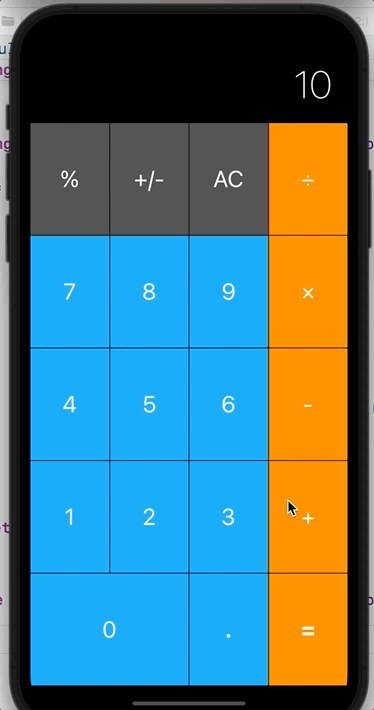

# Calculator
### A basic calculator for iOS, written in Swift

The goal for this project is to create a basic calculator that supports the following functionality:

- Supported math: +, -, *, /, %
- Numbers can be positive or negative;
- Decimal values also supported;
- Supports landscape orientation.

